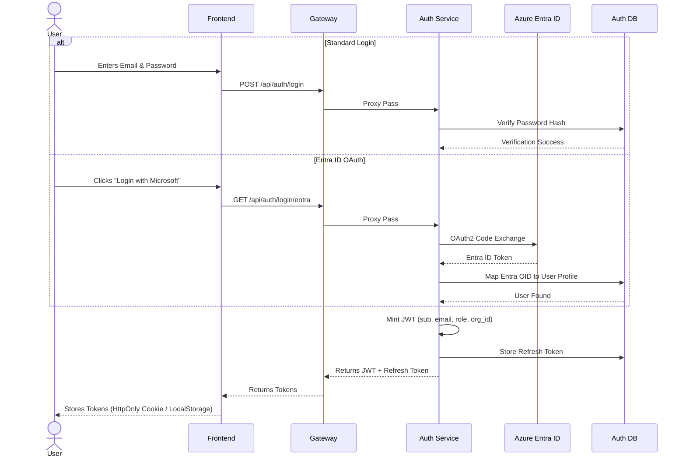

# Authentication Flow

[← Back to Application Architecture](Overview.md)

FlowForge supports two primary methods of authentication: standard Email/Password authentication and Entra ID (Azure AD) Single Sign-On (SSO). Both methods resolve to a unified JWT-based identity system.

## 1. Login Sequence



## 2. Token Format

The API issues a short-lived HS256 JSON Web Token (JWT). The signature is created using the `JWT_SECRET` environment variable, which must be shared between the `auth-service` (for minting) and the `gateway` (for verification).

### Payload Example
```json
{
  "sub": "user_uuid_1234",
  "email": "user@example.com",
  "role": "manager",
  "org_id": "org_uuid_5678",
  "exp": 1718880000,
  "iat": 1718876400
}
```

## 3. Request Verification

For all protected routes, the API Gateway is responsible for authenticating the request.

1. **Intercept**: Gateway extracts the JWT from the `Authorization` header.
2. **Verify Signature**: Gateway checks the JWT signature using `JWT_SECRET`.
3. **Verify Expiration**: Gateway ensures the `exp` claim has not passed.
4. **Header Injection**: Upon success, the Gateway strips the JWT and injects the following headers before proxying the request:
   - `X-User-ID`: Mapped from `sub`
   - `X-User-Email`: Mapped from `email`
   - `X-User-Role`: Mapped from `role`
   - `X-Org-ID`: Mapped from `org_id`

This pattern ensures downstream microservices do not need to implement JWT parsing logic. They can blindly trust the `X-User-*` headers, as the internal network isolates them from external spoofing.
