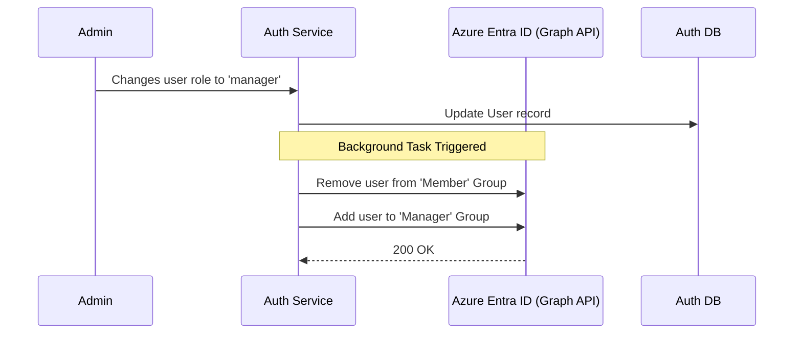

# Authorization Flow

[← Back to Application Architecture](Overview.md)

FlowForge utilizes Role-Based Access Control (RBAC) to enforce security across its microservices. Authorization is strictly decoupled from Authentication.

## Role Model

The application enforces four strict roles:

1. **`platform_admin`**: Superuser with access to platform-wide settings and infrastructure metrics.
2. **`org_owner`**: The owner of an organizational boundary. Can manage all projects and managers within their org.
3. **`manager`**: A user who owns specific projects. Can approve tasks and manage project members.
4. **`member`**: A standard user who can execute tasks within assigned projects.

## Enforcement Mechanism

1. **Trusting the Gateway**: Because the API Gateway verifies the JWT and injects the user's role into the `X-User-Role` HTTP header, downstream microservices do not need to parse JWTs. They implicitly trust this header.
2. **Dependency Injection**: Microservices use dependency injection to enforce role requirements on specific API routes.
   - For example, in FastAPI: `Depends(require_role(["manager", "org_owner"]))`.
   - If the `X-User-Role` header does not match the required roles, the service immediately returns a `403 Forbidden` response.

## Entra ID Synchronization

To maintain parity with enterprise Identity Providers, FlowForge syncs its internal roles with Azure Entra ID (Active Directory) Security Groups.

### Configuration
The mapping between internal roles and Entra ID groups is defined via environment variables in the `auth-service`:
- `ENTRA_GROUP_MANAGER`
- `ENTRA_GROUP_MEMBER`
- `ENTRA_GROUP_ORG_OWNER`

This synchronization allows IT administrators to audit permissions directly from the Azure Portal, knowing they reflect the true state of the FlowForge platform.
