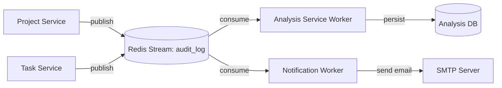

# Event Flows

[← Back to Application Architecture](Overview.md)

Asynchronous communication in FlowForge is handled primarily through a Redis Stream named `audit_log`.

## Architecture Overview

Services emit events to the Redis Stream, acting as Publishers. Dedicated consumer workers or services read from this stream via consumer groups to perform background processing without impacting API response times.

## Known Publishers

1. **Project Service**: Emits events such as `project_created`, `member_added`, `project_archived`.
2. **Task Service**: Emits events such as `task_created`, `status_changed`, `approval_requested`.

## Known Consumers

1. **Notification Worker**
   - **Type**: Standalone Python Worker.
   - **Function**: Reads events and dispatches asynchronous SMTP email notifications for events like task assignments and project changes.
   
2. **Analysis Service (Stream Consumer Worker)**
   - **Type**: Background task running within the Analysis Service.
   - **Function**: Persists raw events to the `audit_events` table in PostgreSQL and computes pre-aggregated data like `daily_task_stats`.

## Reliability Considerations
- **Consumer Groups**: By using Redis Consumer Groups, multiple worker instances can process the stream concurrently without duplicating effort.
- **Message Acknowledgment**: Consumers must `ACK` messages after successful processing. If a consumer crashes before `ACK`ing, the message remains in the Pending Entries List (PEL) and can be claimed by another worker.
