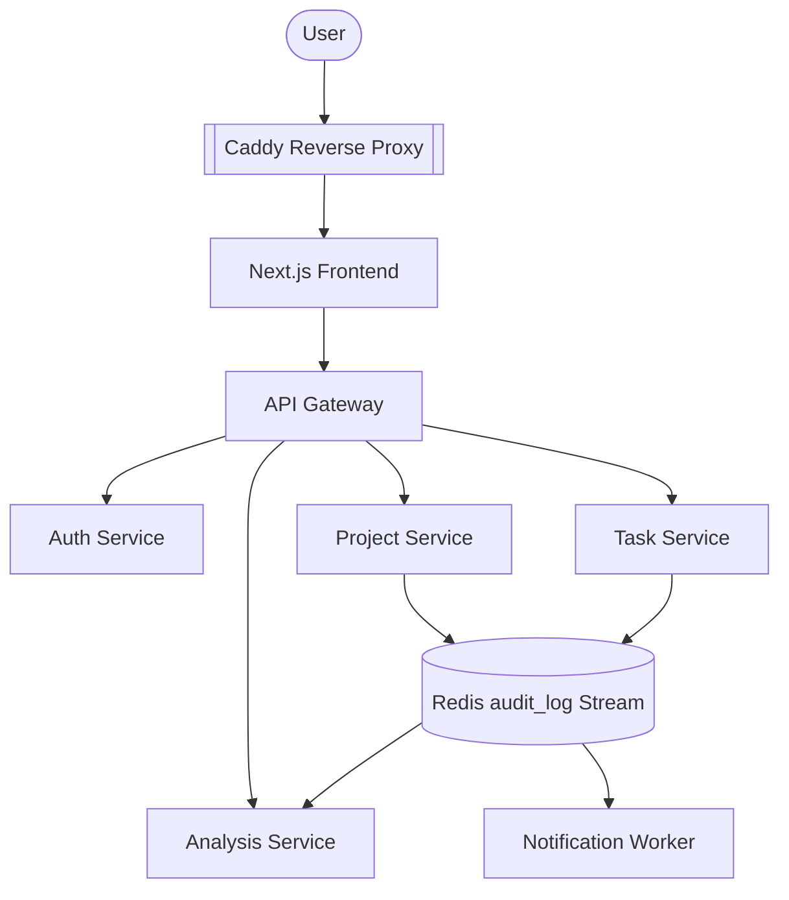

# Application Architecture Overview

[← Back to Main Index](../README.md)

FlowForge is a containerized microservices platform built for enterprise collaboration, task management, and AI-driven analytics. It employs a frontend application, an API gateway, and several backend domain services communicating asynchronously via Redis Streams and synchronously via HTTP.

## Table of Contents
* [System Overview](#system-overview)
* [Request Flow](Request-Flow.md)
* [Service Communication](Service-Communication.md)
* [Event Flows](Event-Flows.md)
* [Authentication Flow](Authentication-Flow.md)
* [Authorization Flow](Authorization-Flow.md)
* [Microservices Catalog](Microservices/README.md)

## System Overview

**Purpose**: FlowForge provides business capabilities for identity management, project collaboration, task tracking with approvals, and AI-powered project analysis.

**Business Capabilities**:
- Identity & Access Management (RBAC integrated with Entra ID)
- Project & Team Management
- Kanban Task Tracking & Manager Approvals
- AI-Driven Summarizations & Analytics
- Asynchronous Email Notifications

**User Personas**:
- **Platform Admin**: Manages the platform infrastructure.
- **Org Owner**: Owns the organizational boundary and data.
- **Manager**: Approves tasks and manages project resources.
- **Member**: Standard user executing tasks within projects.

## High-Level Service Architecture

## Related Documents
* [Kubernetes Architecture](../03-Kubernetes-Architecture/Overview.md)
* [Database Architecture](../02-Database-Architecture/Overview.md)
