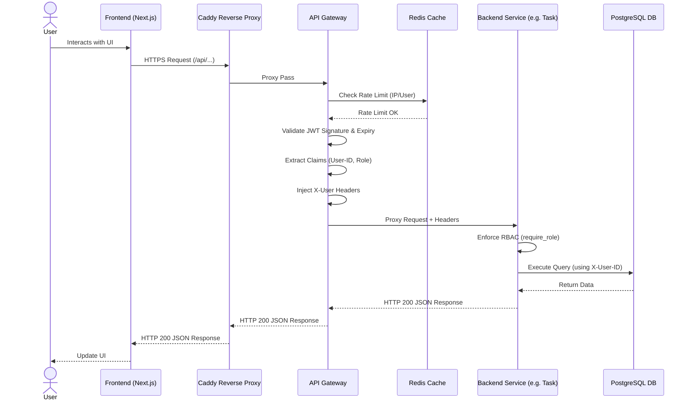

# Request Flow

[← Back to Application Architecture](Overview.md)

This document outlines the end-to-end request flows for typical user operations within the FlowForge platform.

## Standard API Request Flow

The following sequence diagram illustrates the path a standard API request takes from the user's browser through the infrastructure to the backend database.

## Security & Failure Scenarios

- **Rate Limit Exceeded**: If Redis reports the rate limit is exceeded, the Gateway immediately returns `429 Too Many Requests`. The request never reaches the backend service.
- **Invalid JWT**: If the JWT is missing, expired, or invalid, the Gateway immediately returns `401 Unauthorized`.
- **Insufficient Role**: If the User role in `X-User-Role` is insufficient for the requested endpoint, the backend service returns `403 Forbidden`.
