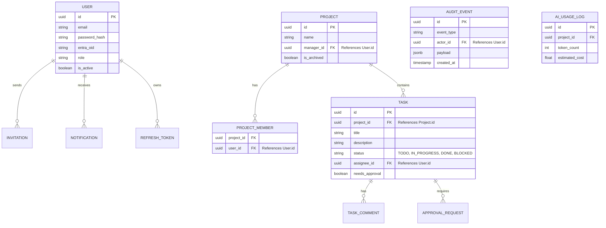

# Entity Relationship Diagram

[← Back to Database Architecture](Overview.md)

While each service maintains its own logical database, the following conceptual ERD shows the relationships between entities across the entire FlowForge platform.

*Note: Cross-service relationships (e.g., a Task referencing a Project) are enforced logically in the application code rather than via hard foreign keys at the database level.*

