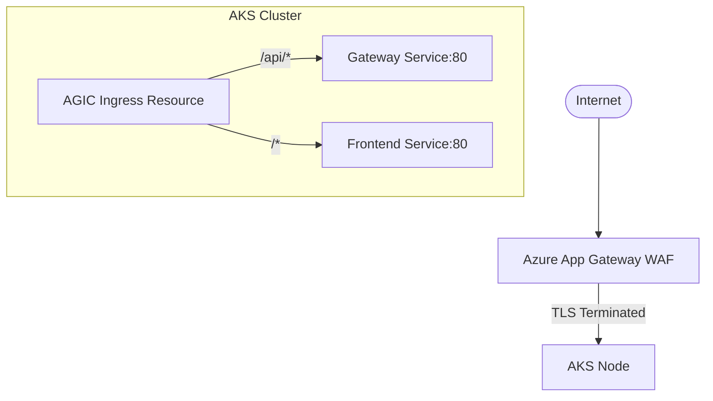

# Ingress Architecture

[← Back to Kubernetes Architecture](Overview.md)

## Application Gateway Ingress Controller (AGIC)

FlowForge utilizes the Azure Application Gateway as its Ingress controller. This provides enterprise-grade WAF capabilities at the edge of the virtual network before traffic ever reaches the AKS cluster.

### Ingress Configuration
- **Class**: `kubernetes.io/ingress.class: azure/application-gateway`
- **Location**: Defined centrally in `Helm/templates/ingress.yaml`

### Routing Rules
Traffic arriving at the Application Gateway is routed based on path prefixes:
- `path: /api/*` -> Routes to the `gateway` microservice on port 80.
- `path: /*` -> Routes to the `frontend` microservice on port 80.

### TLS / SSL Management
- TLS termination occurs at the Application Gateway.
- Certificates are automatically provisioned and rotated using **Cert-Manager**.
- Configured via a `ClusterIssuer` named `letsencrypt-prod`.

