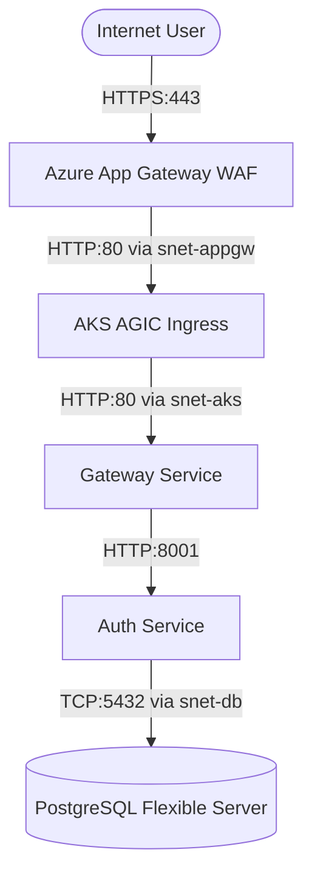
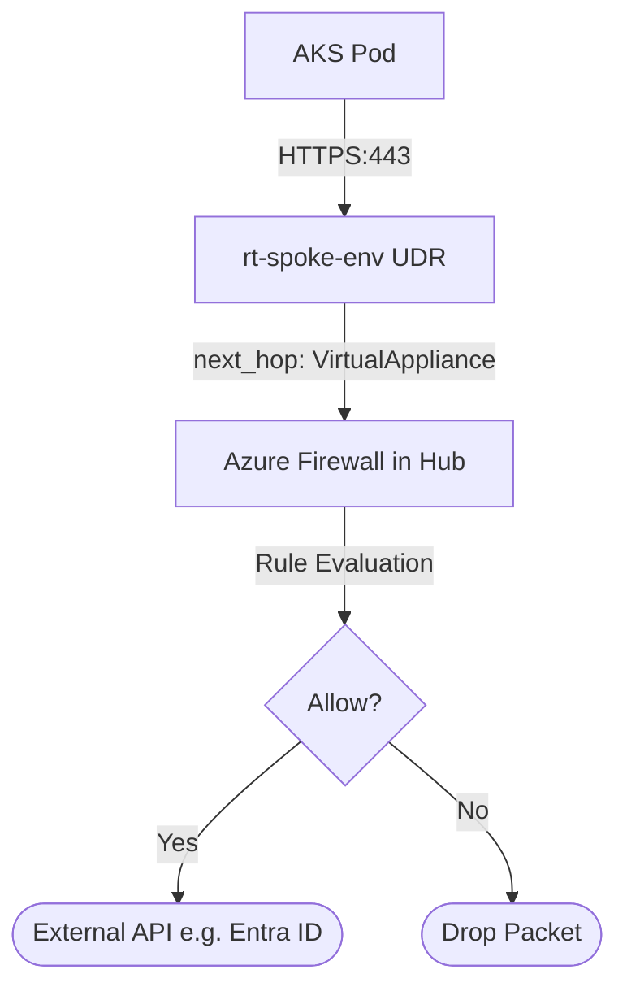
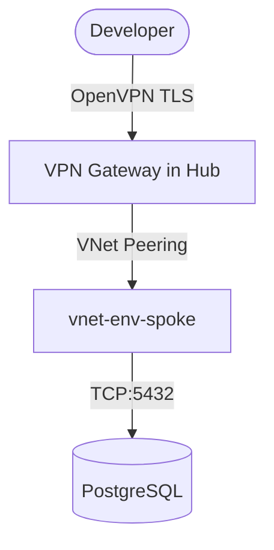

# Traffic Flow

[← Back to Cloud Architecture](Overview.md)

This document visualizes the exact network hops for inbound and outbound traffic.

## Inbound Traffic (Internet to Service)

## Outbound Traffic (Service to Internet)

To ensure data exfiltration prevention, AKS nodes cannot reach the internet directly. 

*Note: The Firewall explicitly allows egress to AKS required FQDNs and NTP services.*

## Developer VPN Traffic

