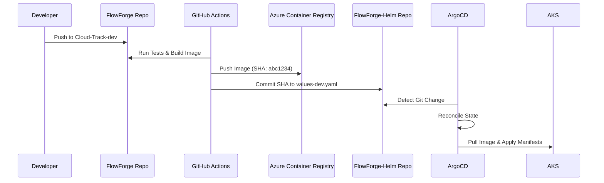

# GitOps & ArgoCD

[← Back to CI/CD Architecture](Overview.md)

Instead of utilizing push-based commands like `helm upgrade` within GitHub Actions, FlowForge employs a strict GitOps methodology managed by ArgoCD. Workflows act as updaters to a centralized state repository (`FlowForge-Helm`).

## GitOps Workflow

## ArgoCD Configuration
ArgoCD is configured to synchronize Kubernetes state directly with the `FlowForge-Helm` repository.

- **Dev Application (`argocd-dev-app.yaml`)**:
  - Automatically syncs the `Helm` directory from the `Cloud-Track-dev` branch of the `FlowForge-Helm` repository to the `flowforge-dev` namespace.
  - Combines `values-common.yaml` and `values-dev.yaml`.
- **Prod Application (`argocd-prod-app.yaml`)**:
  - Automatically syncs the `Helm` directory from the `main` branch of the `FlowForge-Helm` repository to the `flowforge-prod` namespace.
  - Combines `values-common.yaml` and `values-prod.yaml`.

Both applications use automated sync policies with `prune: true` and `selfHeal: true`.
