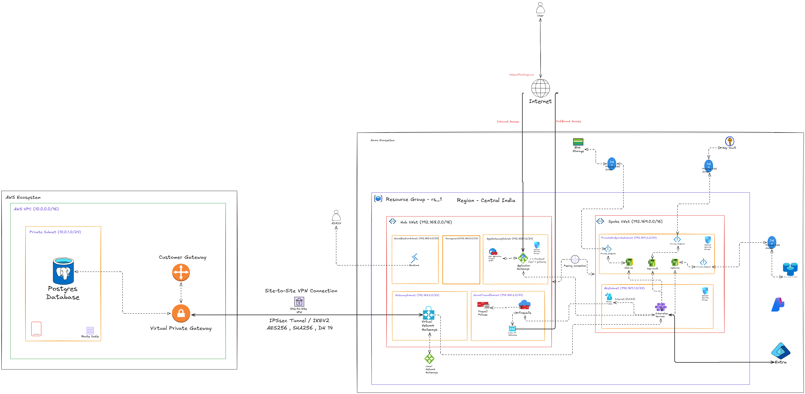

# Hybrid Cloud App Deployment Architecture

---

## 1. Implemented Components & Topology

The environment leverages a highly secure Hub-and-Spoke topology within Azure, peered with an AWS Virtual Private Cloud (VPC) to house database assets.

### Azure Ecosystem (Region: Central India | Resource Group: rs_1)

#### Hub VNet (`192.168.0.0/16`)
The Hub VNet acts as the central point for internet ingress/egress and cross-cloud connectivity.
- **AppGatewaySubnet (`192.168.1.0/24`)**: Hosts the Application Gateway and Web Application Firewall (WAF) to manage inbound web traffic from the internet.
- **AzureFirewallsSubnet (`192.168.2.0/24`)**: Houses the Azure Firewall and its Public IP. All outbound traffic from the internal network is routed here for inspection.
- **GatewaySubnet (`192.168.3.0/24`)**: Contains the Azure Virtual Network Gateway and Local Network Gateway configurations required for the IPSec VPN connection to AWS.
- **AzureBastionSubnet (`192.168.4.0/24`)**: Hosts Azure Bastion, providing secure, agentless administrative RDP/SSH access to internal resources without exposing public IP addresses.

#### Spoke VNet (`192.169.0.0/16`)
The Spoke VNet is peered with the Hub VNet and hosts the core application workloads.
- **AksSubnet (`192.169.1.0/24`)**: Runs the Azure Kubernetes Service (AKS) cluster where the application's microservices are deployed.
- **PrivateEndpointSubnet (`192.169.2.0/24`)**: Contains Private Endpoints to ensure that traffic to Azure PaaS services (Blob Storage, Key Vault, Redis Cache) remains securely on the Microsoft backbone network. This subnet works in tandem with **Private DNS Zones** to resolve internal FQDNs.

### AWS Ecosystem (Database Layer)
- **AWS VPC (`10.0.0.0/16`)**: The isolated virtual network in AWS.
- **Private Subnet (`10.0.1.0/24`)**: Contains the primary **Postgres Database**, entirely cut off from the public internet.
- **VPN Gateways**: A Virtual Private Gateway (attached to the VPC) and a Customer Gateway (representing the Azure side) terminate the VPN connection.

---

## 2. Multi-Cloud Architecture & Cross-Cloud Data Transmission

To ensure that the Azure application workloads (AKS) can securely query the AWS Postgres database, a dedicated **Site-to-Site (S2S) VPN** bridges the two cloud environments. 

### How Data Transmission Works
Data transmission between the two clouds occurs securely over the public internet by creating an encrypted tunnel between the **Azure Virtual Network Gateway** and the **AWS Virtual Private Gateway**. Traffic from the AKS subnet destined for `10.0.1.0/24` (the AWS Private Subnet) is automatically routed to the Azure VPN Gateway, encrypted, sent across the internet, decrypted by the AWS VPN Gateway, and finally forwarded to the Postgres database.

### Site-to-Site VPN Specifications
The connection uses an **IPSec (Internet Protocol Security)** tunnel running on **IKEv2 (Internet Key Exchange version 2)**. The tunnel is secured using the following cryptographic standards:
- **Encryption Algorithm: AES256 (Advanced Encryption Standard)**: Uses 256-bit symmetric keys to encrypt the data payload, providing military-grade confidentiality.
- **Hashing/Integrity Algorithm: SHA256 (Secure Hash Algorithm)**: Generates a 256-bit hash for each packet, ensuring that data is not tampered with or corrupted while traversing the internet.
- **Key Exchange: DH 14 (Diffie-Hellman Group 14)**: A 2048-bit modular exponentiation group used to securely negotiate and exchange the AES encryption keys over the unencrypted internet during the IKE Phase 1 setup.

---

## 3. Network Security, Firewalls & Routing

Security is heavily layered across the network, applying different protections depending on the traffic type and OSI layer.

### Layer 7 Protection (WAF v2)
- **Location**: `AppGatewaySubnet` via the Azure Application Gateway.
- **Functionality**: The Web Application Firewall (WAF) operates at Layer 7 (Application Layer). It inspects all incoming HTTP/HTTPS traffic targeting `https://Flowforge.com`.
- **Configuration**: It is configured with managed rulesets to detect and block common web vulnerabilities such as SQL injection, cross-site scripting (XSS), and malicious bot activity before the traffic is allowed to reach the AKS cluster.

### Layer 4 Protection & Egress Filtering (Azure Firewall)
- **Location**: `AzureFirewallsSubnet` via Azure Firewall.
- **Functionality**: Operates primarily at Layer 4 (Transport Layer) but supports Layer 7 filtering for outbound connections.
- **Rules Setup**:
  - **Network Rules**: Configured to explicitly allow or deny traffic based on source IP, destination IP, port, and protocol (e.g., allowing outbound TCP on port 443).
  - **Application Rules**: Configured to allow traffic based on Fully Qualified Domain Names (FQDNs), ensuring that AKS can only reach approved external APIs or container registries.
- **Routing Configuration (UDRs)**: A User Defined Route (Route Table) is attached to the `AksSubnet`. The route specifies that any traffic destined for the internet (`0.0.0.0/0`) must be sent to the Azure Firewall's private IP address as the next hop. This guarantees all egress traffic is inspected and logged.

### Internal Micro-segmentation (NSGs)
- Network Security Groups (NSGs) are attached to individual subnets to restrict lateral movement. For instance, NSG rules ensure that only the `AksSubnet` can initiate connections to the `PrivateEndpointSubnet`.

---

## 4. End-to-End Traffic Flow

When the entire architecture operates together, traffic flows through the system in the following sequence:

1. **User Ingress**: A user visits `https://Flowforge.com`. The request hits the public IP of the Azure Application Gateway.
2. **WAF Inspection**: The WAF at Layer 7 inspects the request. If it passes security checks, the Application Gateway decrypts the SSL traffic and forwards it over the VNet Peering to the internal AKS cluster in the Spoke VNet.
3. **Application Processing**: The AKS microservices receive the request. 
4. **Internal PaaS Integration**: If the application needs to read a cache, retrieve a secret, or fetch a file, it connects to Redis, Key Vault, or Blob Storage securely using the Private Endpoints. The traffic stays entirely on the Azure private backbone.
5. **Cross-Cloud Database Query**: If the application requires relational data, the microservice queries the Postgres IP (e.g., `10.0.1.X`). The Azure Route Table directs this traffic to the Azure Virtual Network Gateway, where it is AES256-encrypted and sent across the IPSec tunnel to the AWS Virtual Private Gateway, which decrypts it and sends it to the private Postgres database.
6. **Egress Internet Traffic**: If an AKS pod needs to download an external package or call a third-party payment API, the User Defined Route (`0.0.0.0/0`) forces the request out through the Azure Firewall in the Hub VNet. The Firewall checks its Application and Network Rules; if allowed, the traffic is NAT'd out to the internet through the Firewall's public IP.
