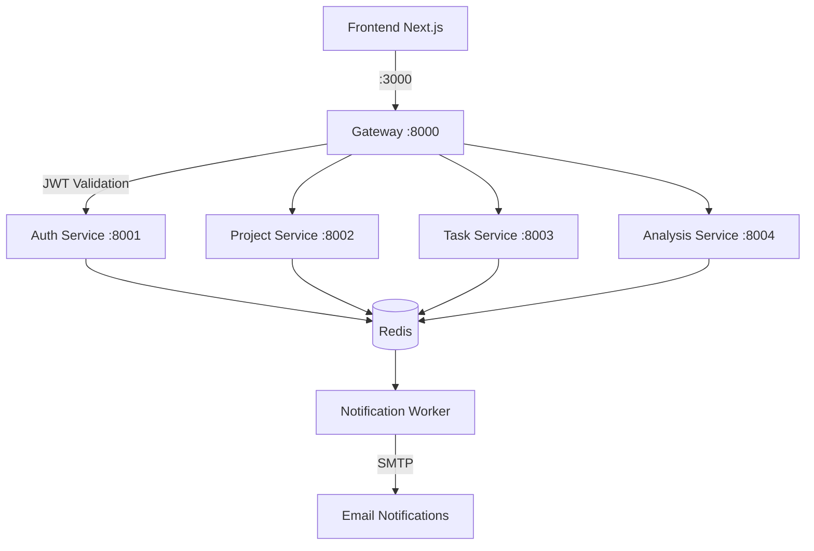

# FlowForge - Project & DevOps Infrastructure Documentation

## 1. Introduction
FlowForge is a Microsoft-Native Self-Hosted Project Management Suite tailored for DevOps training. It provides a clean, focused Kanban-style workspace while keeping all project data, AI-generated reports, and team metadata entirely within your Azure tenant.

## 2. Why FlowForge?
Traditional project management tools impose complex pricing models, steep learning curves, and significant data privacy concerns. FlowForge solves this by running inside your own Azure environment and integrating natively with the services you already use:
- **Microsoft Entra ID (Azure AD)**: Corporate SSO — users log in with existing Microsoft credentials. Roles are auto-assigned from Entra ID Security Groups.
- **Azure PostgreSQL Flexible Server**: Private, encrypted database with Managed Identity auth.
- **Azure Cache for Redis**: High-speed session rate-limiting and async event streaming between services.
- **Azure AI Foundry (OpenAI)**: Automatically generates project progress summaries and organizational AI digests.
- **Azure Blob Storage**: Stores generated reports and Terraform state securely.
- **Azure Key Vault**: Central, private secret store fetched at runtime.

## 3. Application Architecture & Microservices
FlowForge is composed of 7 decoupled services orchestrated as a multi-tenant microservices platform.

### System Diagram

### Services Overview
| Service | Framework | Role |
| :--- | :--- | :--- |
| **`gateway`** | FastAPI | BFF proxy — JWT validation, rate limiting, CORS, header injection, routing. |
| **`auth-service`** | FastAPI + SQLAlchemy | User management, Entra ID SSO, invitations, in-app notifications. |
| **`project-service`** | FastAPI + SQLAlchemy | Project CRUD, member management, soft-archiving. |
| **`task-service`** | FastAPI + SQLAlchemy | Kanban boards, task lifecycle, comments, manager approval gates. |
| **`analysis-service`** | FastAPI + SQLAlchemy | AI summaries (Azure AI Foundry), analytics aggregation, report generation. |
| **`notification-worker`** | Python asyncio | Redis stream consumer — sends SMTP emails for all platform events. |
| **`frontend`** | Next.js 14 | React App Router UI — Entra SSO params baked in at Docker build time. |

### How Requests Flow
**Key security layer**: The Gateway injects `X-User-ID`, `X-User-Role`, `X-User-Email`, `X-Org-ID` headers into every forwarded request. Downstream services do not independently validate the JWT but rely on these headers and an `INTERNAL_API_KEY`.

## 4. Role-Based Access Control (RBAC)
FlowForge incorporates a comprehensive 4-tier Role-Based Access Control system:
`platform_admin  →  org_owner  →  manager  →  member`

Roles are dynamically resolved at login from Entra ID Security Group memberships.

## 5. CI/CD Workflows & Shift-Left Security
We employ Enterprise GitOps models using GitHub Actions combined with GitHub Environments to fully automate the delivery of both application code and infrastructure.

### Workflows Overview
- **Infrastructure Pipeline (`terraform-gitops.yml`)**:
  - **Triggers**: Push to `Cloud-Track-dev` or `main`.
  - **Actions**: Validates code, runs Snyk IaC scanning, `terraform plan`. Stops at Environment Gate. Upon approval, executes `terraform apply`.
- **Application Pipeline (`prod-release.yml`)**:
  - **Triggers**: Published releases tags (`<service>-v<version>`).
  - **Actions**: Retrieves Dev Docker images, retags/pushes to GitHub Container Registry (GHCR) for Prod, updates Helm `values-prod.yaml`.
- **Service CI Pipelines**:
  - Push triggers run: **SonarQube** → **Snyk** → **Docker Build** → **Trivy** → **OIDC ACR Push** → **Helm values update**.

### Security & Federated Credentials
To avoid storing static Azure credentials, GitHub Actions authenticates via **Azure OpenID Connect (OIDC)** (Federated Credentials). GitHub Environments enforce manual review gates.

## 6. Terraform Infrastructure
Our Terraform setup enforces a Single Physical Environment strategy.
- **Structure**: Uses `modules/` for reusable components and `env/dev`, `env/prod` for configurations.
- **State Management**: Uses Azure Blob Storage securely via OIDC.
- **Security**: Service Principal is limited to `Contributor` and `Role Based Access Control Administrator` roles at the specific Resource Group level.

## 7. Helm Deployment Setup
FlowForge is deployed via Kubernetes using an Umbrella Helm Chart.
- **Structure**: An Umbrella Chart (`Chart.yaml`) includes all microservices as dependencies located in `charts/`.
- **Automation**: CI/CD uses `yq` to update the microservice `image.tag` inside `values-prod.yaml` and commits back, triggering GitOps continuous delivery via ArgoCD.

## 8. Deployment Guide
### Step 1: Azure Preparation
1. Create Resource Groups (`RG-Dev`, `RG-Prod`) and Azure Storage Account for Terraform state.
2. Create an App Registration in Microsoft Entra ID.
3. Establish Federated Credentials (OIDC) for `Cloud-Track-dev` and `main` branches.
4. Assign appropriate RBAC roles scoped to Resource Groups.

### Step 2: Secrets Configuration
- **GitHub Secrets**: Add `AZURE_CLIENT_ID`, `AZURE_TENANT_ID`, `AZURE_SUBSCRIPTION_ID`, `GH_PAT`, `SNYK_TOKEN`, `MAIL_USERNAME`, `MAIL_PASSWORD`, `DEVELOPMENT_TEAM_EMAIL`.
- **Application Secrets**: Sync locally via `secrets.env` and securely populate Azure Key Vault.

### Step 3: Provisioning & Deployment
1. Push Terraform code to trigger CI pipeline. Review the `terraform plan`.
2. Merge to `main` and approve GitHub Environment Gate to execute `apply`.
3. Wait for microservice pipelines to push images to GHCR.
4. Apply the Umbrella Helm chart to the AKS cluster via GitOps.
